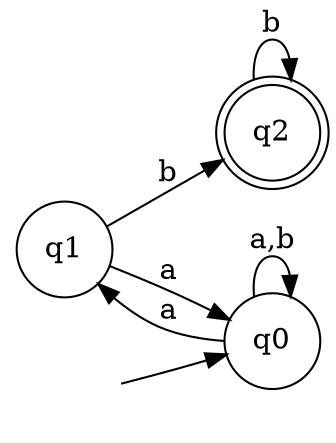
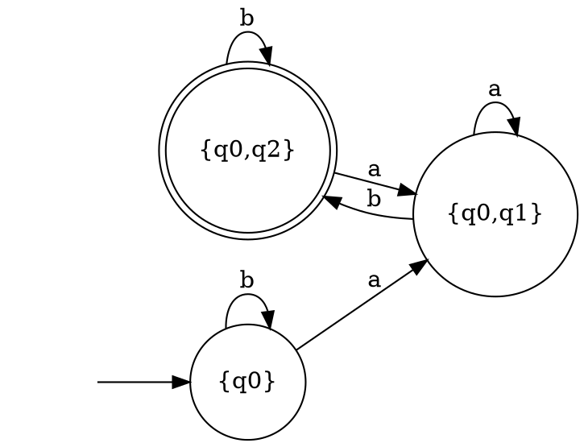

# Laboratory Work 2 — Determinism in Finite Automata. NDFA to DFA Conversion. Chomsky Hierarchy.

### Course: Formal Languages & Finite Automata
### Author: Strunga Daniel-Ioan, FAF-242
### Variant: 23

---

## Theory

A **Finite Automaton (FA)** is a 5-tuple `(Q, Σ, δ, q0, F)` where:
- `Q` — finite set of states
- `Σ` — input alphabet
- `δ` — transition function `Q × Σ → P(Q)`
- `q0 ∈ Q` — initial state
- `F ⊆ Q` — set of accepting (final) states

An FA is **deterministic (DFA)** if for every `(state, symbol)` pair there is **at most one** next state and no ε-transitions. Otherwise it is **non-deterministic (NDFA)**.

The **Chomsky hierarchy** classifies formal grammars into four types:
| Type | Name | Constraint |
|------|------|------------|
| 0 | Unrestricted | No restrictions |
| 1 | Context-Sensitive | `|LHS| ≤ |RHS|` |
| 2 | Context-Free | LHS is a single non-terminal |
| 3 | Regular | Right- or left-linear productions only |

---

## Variant 23 — Given FA

```
Q  = {q0, q1, q2}
Σ  = {a, b}
F  = {q2}
q0 = q0

δ(q0, a) = q0
δ(q0, a) = q1   ← same input, two targets → NDFA
δ(q0, b) = q0
δ(q1, b) = q2
δ(q1, a) = q0
δ(q2, b) = q2
```

---

## Objectives & Implementation

### Objective 1 — Chomsky Classification (`grammar.py`)

The `Grammar` class was extended with a `classify_chomsky()` method that tests each type from most restrictive (Type 3) down to Type 0.

Key logic for Type 3 detection uses a symbol parser that handles multi-character non-terminal names (e.g. `q0`, `q1`) by greedy matching against `VN`:

```python
def _parse_rhs(self, prod):
    symbols = []
    i = 0
    vn_sorted = sorted(self.VN, key=len, reverse=True)
    while i < len(prod):
        for nt in vn_sorted:
            if prod[i:].startswith(nt):
                symbols.append(('NT', nt)); i += len(nt); break
        else:
            symbols.append(('T', prod[i])); i += 1
    return symbols
```

A production `A → tB` is right-linear if the parsed symbols are `[T, NT]`, and `A → t` if just `[T]`.

---

### Objective 2 — FA → Regular Grammar (`finite_automaton.py`, method `to_regular_grammar`)

**Algorithm:** For each NDFA transition `δ(p, a) = q`:
- Add production `p → a q` (continue derivation)
- If `q ∈ F`, also add `p → a` (string can end here)

Applied to Variant 23:

```
q0 → a q0 | a q1 | b q0
q1 → b q2 | b | a q0
q2 → b q2 | b
```

The grammar is **right-linear** → classified as **Type 3 — Regular**.

---

### Objective 3 — Determinism Check (`is_deterministic`)

```python
def is_deterministic(self):
    for state, transitions in self.delta.items():
        for symbol, targets in transitions.items():
            if symbol == 'ε':
                return False
            if len(targets) > 1:
                return False
    return True
```

Result for Variant 23:

```
The automaton is: NDFA (Non-Deterministic)
Reason: δ(q0,a) = q0  AND  δ(q0,a) = q1
        → same state + symbol leads to multiple states
```

---

### Objective 4 — NDFA → DFA (Subset Construction, `to_dfa`)

**Algorithm:** Each DFA state represents a **set of NDFA states** reachable simultaneously.

Starting from `{q0}`, for each symbol compute the union of reachable NDFA states:

| DFA State | On `a` | On `b` |
|-----------|--------|--------|
| `{q0}` | `{q0, q1}` | `{q0}` |
| `{q0, q1}` | `{q0, q1}` | `{q0, q2}` |
| `{q0, q2}` | `{q0, q1}` | `{q0, q2}` |

**DFA result:**
- States: `{q0}`, `{q0,q1}`, `{q0,q2}`
- Start: `{q0}`
- Final: `{q0,q2}` (contains `q2 ∈ F`)
- Verified deterministic: ✅ `True`

---

### Bonus — Graphviz DOT Export (`to_dot`)

The `to_dot()` method generates DOT language output for both NDFA and DFA. Render with:

```bash
echo "<dot output>" | dot -Tpng -o fa.png
# or with Python:
# graphviz.Source(fa.to_dot()).render('fa', format='png')
```

**NDFA (DOT):**


**DFA after conversion (DOT):**


---

## Program Output

```
=======================================================
  3b — DFA or NDFA?
=======================================================
  The automaton is: NDFA (Non-Deterministic)
  Reason: δ(q0,a) = q0  AND  δ(q0,a) = q1
          → same state + symbol leads to multiple states

=======================================================
  3a — FA → Regular Grammar
=======================================================
  VN = ['q0', 'q1', 'q2']
  VT = ['a', 'b']
  S  = q0
  Productions:
    q0 → aq0 | aq1 | bq0
    q1 → bq2 | b | aq0
    q2 → bq2 | b

=======================================================
  Chomsky Classification of derived grammar
=======================================================
  Type 3 - Regular Grammar

=======================================================
  3c — NDFA → DFA  (Subset Construction)
=======================================================
  DFA States : ['{q0,q1}', '{q0,q2}', '{q0}']
  Start      : {q0}
  Final      : ['{q0,q2}']
  Transitions:
    δ({q0,q1}, a) = {q0,q1}
    δ({q0,q1}, b) = {q0,q2}
    δ({q0,q2}, a) = {q0,q1}
    δ({q0,q2}, b) = {q0,q2}
    δ({q0}, a) = {q0,q1}
    δ({q0}, b) = {q0}

  Verify DFA is now deterministic: True
```

---

## Conclusions

- Variant 23's FA is **non-deterministic** because `δ(q0, a)` maps to two states simultaneously.
- The FA was successfully converted to an equivalent **right-linear regular grammar** (Type 3 in the Chomsky hierarchy).
- The **subset construction** algorithm produced an equivalent DFA with 3 states (no state explosion in this case), verified to be deterministic.
- The bonus DOT export allows visual rendering of both automata using Graphviz.

---

## Project Structure

```
lab2/
├── grammar.py           # Grammar class + Chomsky classification
├── finite_automaton.py  # FA class: to_regular_grammar, is_deterministic, to_dfa, to_dot
└── main.py              # Client demo — Variant 23
```
